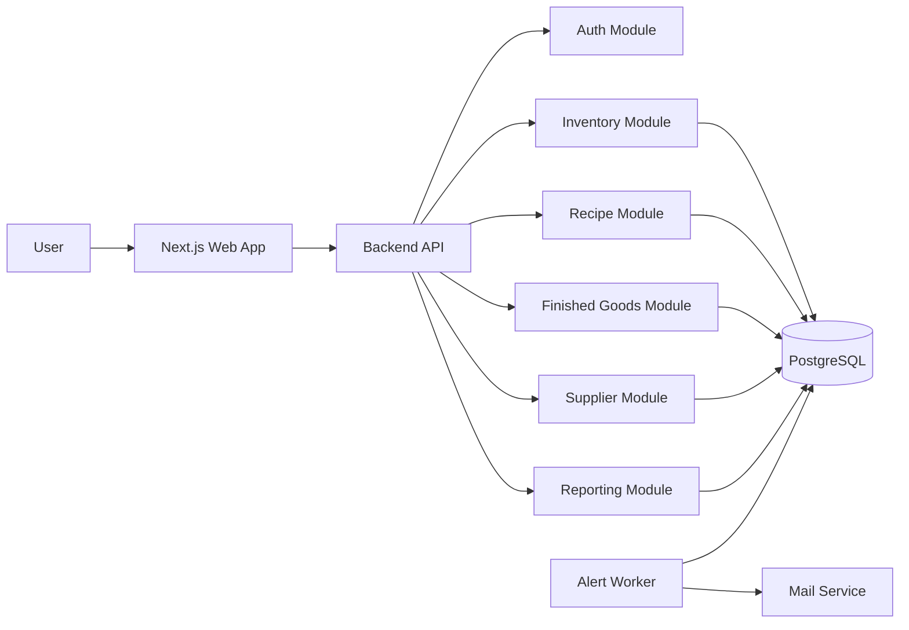

# Solution Architecture - Food Inventory Web

## 1. Muc tieu he thong

He thong quan ly nguyen vat lieu (NVL) va thanh pham cho mo hinh da nha may/da kho, ho tro:

- Theo doi ton kho theo lo (batch-level traceability)
- Xuat kho FIFO theo lo nhap
- Bao mat cong thuc (recipe/BOM) theo RBAC chi tiet
- Canh bao ton thap va luu kho qua nguong
- Bao cao van hanh + tai chinh theo thang

## 2. Nguyen tac thiet ke

- **Modular monolith truoc, mo rong microservice sau**: giam do phuc tap giai doan dau.
- **Transaction-first**: nghiep vu nhap/xuat/san xuat phai duoc xu ly ACID trong PostgreSQL.
- **Single source of truth cho ton kho**: moi bien dong ton phat sinh qua `stock_movements`.
- **Secure-by-default**: permission check tai backend cho moi API nhay cam.
- **Auditability**: luu lich su thay doi recipe, gia nhap, va bien dong kho co ly do.

## 3. Bounded context va module boundaries

### 3.1 Auth & Access Control

Trach nhiem:
- Quan ly user, role, permission
- Mapping user -> plant/warehouse scope
- Enforce permission (`recipe.view`, `recipe.manage`, `inventory.issue`, ...)

Khong phu trach:
- Khong luu logic FIFO
- Khong tinh KPI bao cao

### 3.2 Inventory

Trach nhiem:
- Nhap/xuat/huy/chuyen kho theo lo
- Tinh ton hien tai tu ledger
- Engine FIFO cap phat lo cho nghiep vu xuat

Khong phu trach:
- Khong quan ly cong thuc san pham
- Khong gui email canh bao truc tiep

### 3.3 Recipe/BOM

Trach nhiem:
- Dinh nghia cong thuc thanh pham (`recipes`, `recipe_items`)
- Versioning va change log cong thuc
- Permission gate nghiem ngat cho view/manage

Khong phu trach:
- Khong truc tiep tru ton kho

### 3.4 Finished Goods / Production

Trach nhiem:
- Tao lenh san xuat
- Consume NVL theo BOM + FIFO qua Inventory service
- Nhap kho thanh pham sau san xuat

Khong phu trach:
- Khong quan ly nha cung cap

### 3.5 Suppliers & Procurement

Trach nhiem:
- Master data nha cung cap
- Phieu nhap va lich su gia nhap theo tung dot

Khong phu trach:
- Khong thuc hien consume san xuat

### 3.6 Reporting

Trach nhiem:
- KPI dashboard ton/hao hut/tieu thu
- Bao cao thang xuat/nhap/huy/chi phi/tong ton
- Snapshot theo ky de toi uu truy van

Khong phu trach:
- Khong cap nhat du lieu nghiep vu goc

### 3.7 Alert Worker

Trach nhiem:
- Chay job dinh ky canh bao ton thap va ton lau ngay
- Gui email thong qua Mail service provider

Khong phu trach:
- Khong cap nhat giao dich nhap/xuat

## 4. Kien truc runtime



## 5. Security model

- JWT/OIDC session cho web app
- Permission matrix theo role, gom:
  - `recipe.view`
  - `recipe.manage`
  - `inventory.receive`
  - `inventory.issue`
  - `inventory.adjust`
  - `production.create`
  - `report.view`
- Policy scope:
  - Theo `plant_id`
  - Theo `warehouse_id` (neu role bi gioi han)
- API recipe bat buoc check backend authorization, khong chi an UI
- Cong thuc hien thi co the mask dinh luong nhay cam tuy role

## 6. Data consistency va giao dich

- Nhap kho:
  - Tao `purchase_receipt` + items
  - Tao `material_batches`
  - Ghi `stock_movements` type `RECEIPT`
- Xuat kho/FIFO:
  - Lock cac lo ung vien (`FOR UPDATE`) theo `received_at`, `batch_id`
  - Tinh cap phat FIFO
  - Ghi `stock_movements` type `ISSUE`
- San xuat:
  - Transaction bao gom consume NVL + nhap thanh pham
  - Rollback toan bo neu bat ky buoc loi

## 7. Non-functional requirements

- **Availability**: muc tieu >= 99.5%
- **Audit log retention**: >= 24 thang
- **P95 API latency**:
  - CRUD master data <= 300ms
  - Nghiep vu xuat/FIFO <= 700ms (duoi tai thong thuong)
- **Scalability**:
  - Scale ngang API/worker
  - DB read replica cho reporting khi can

## 8. De xuat cau truc thu muc

```text
docs/
  solution-architecture.md
  api-spec.md
backend/
  db/migrations/
  src/modules/
    auth/
    inventory/
    recipes/
    finished-goods/
    suppliers/
    reports/
  src/jobs/alert-worker.ts
frontend/
  src/app/
    dashboard/
    materials/
    finished-goods/
    recipes/
    reports/
```

## 9. Lo trinh trien khai

1. Nen tang:
   - Auth/RBAC
   - Master data
   - Nhap kho theo lo
2. San xuat ton kho:
   - Recipe/BOM
   - Xuat FIFO theo BOM
   - Nhap thanh pham
3. Canh bao bao cao:
   - Alert worker + email
   - Monthly report + snapshot
4. UAT va go-live:
   - Kich ban doi soat kho
   - Hardening permission
   - Checklist van hanh
